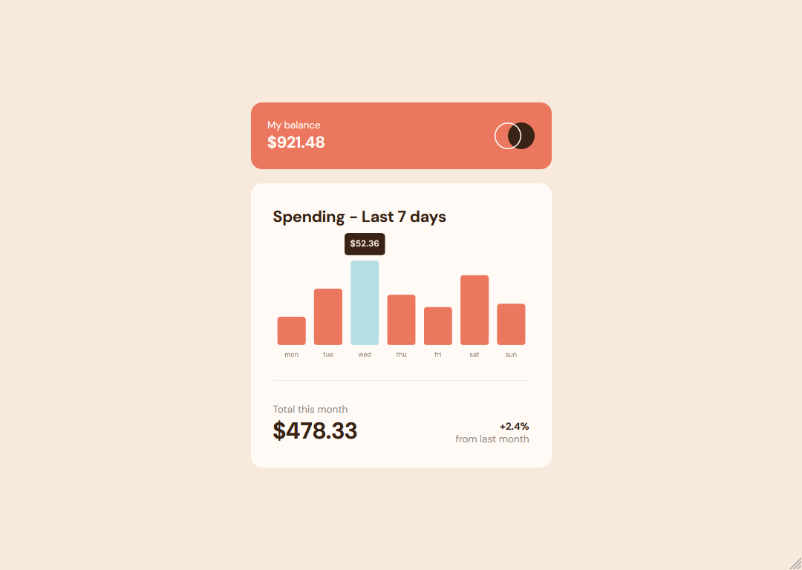
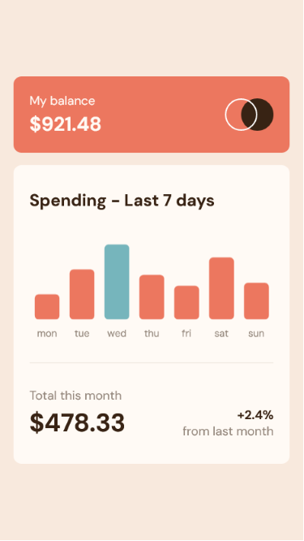

# Frontend Mentor - Expenses chart component solution

This is a solution to the [Expenses chart component challenge on Frontend Mentor](https://www.frontendmentor.io/challenges/expenses-chart-component-e7yJBUdjwt). Frontend Mentor challenges help you improve your coding skills by building realistic projects. 

## Table of contents

- [Overview](#overview)
  - [The challenge](#the-challenge)
  - [Screenshot](#screenshot)
- [My process](#my-process)
  - [Built with](#built-with)
  - [What I learned](#what-i-learned)
- [Author](#author)

## Overview

### The challenge

Users should be able to:

- View the bar chart and hover over the individual bars to see the correct amounts for each day
- See the current day’s bar highlighted in a different colour to the other bars
- View the optimal layout for the content depending on their device’s screen size
- See hover states for all interactive elements on the page
- **Bonus**: Use the JSON data file provided to dynamically size the bars on the chart

### Screenshots

## My process

### Built with

- Semantic HTML5 markup
- CSS custom properties
- Flexbox
- CSS Grid
- Mobile-first workflow
- [Vanilla JS](http://vanilla-js.com/) - JavaScript
- [Chart JS](https://www.chartjs.org/docs/latest/) - Javascript library for charts
- [Sass](https://sass-lang.com/) - CSS extension language
- [Vite](https://vitejs.dev/) - Development environment

### What I learned

- Developed HTML dynamically using JavaScript.
- Displayed values dynamically based on the responsive browser.
- Implemented Chart.js for interactive visualizations.
- Customized Chart elements, including tooltips, bars, and x-y grids, as well as x-y labels.

## Author

- Website - [Ruo-Fang Wang](https://wang0857.github.io/myWebPortfolios/)
- Frontend Mentor - [Ruo-Fang Wang](https://www.frontendmentor.io/profile/wang0857)
- LinkedIn - [Ruo-Fang Wang](https://ca.linkedin.com/in/ruo-fang-wang-550269226)